# Assalamu alaykum! Рад вас видеть на своём курсе!

## Я Djamalov Aziz Mansurovich

## Расскажите, какой у вас опыт в IT – мне будет интересно узнать!

## WiFi Built-Brain: MuhammadAli

## https://t.me/Python_BackEnd_DevOps_1
## @Python_BackEnd_DevOps_1

## На протяжении курса мы будем углубляться в три ключевые области Python(Back-End) & DevOps

---
---
---
# **Python:**
## Язык программирования, и то почему многие выбирают именно его:
1. популярность [Tibe-Index](https://www.tiobe.com/tiobe-index/)
2. востребованность [Head hunter](https://samarkand.hh.uz/)
3. [Большая экосистема и количество модулей и готовых решений](https://pypi.org/)
4. простота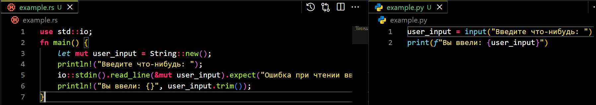
5. легкий collaboration между разработчиками
6. большое сообщество [community](https://www.python.org/community/)
7. быстрая разработка
8. отличная интеграция с другими языками
9. универсальность и широкая сфера применения:
  - Отросли где Python популярен:
    - Back-End
    - DevOps
    - AI
    - Data Science
    - Тестирование
    - Cybersecurity
    - BOT
  - Отросли где Python набирает обороты:
    - Web3
    - IoT
10. Python – язык, который не устаревает!
  - Python остается актуальным и востребованным уже более 30 лет, и его популярность только растет. Почему?
    - Постоянно обновляется – новые версии улучшают скорость и функциональность.
    - Широкая поддержка в IT-гигантах – Google, Microsoft, Amazon инвестируют в Python.
    - Популярен среди стартапов и крупных компаний – от небольших проектов до систем мирового уровня.
    - Используется в новых технологиях – Web3, AI, Big Data, автоматизация.
    - Легко учить – сложно заменить – Python уже стал стандартом в разработке.

## Мы в этом курсе будем использовать его для: 
- создания Back-End
- автоматизации задач
- создания БОТОВ
- в DevOps
- тестировании
- и не только!

---
---
---
# **Back-End -**
## - это серверная часть приложения, которая отвечает за обработку данных, бизнес-логику, безопасность и взаимодействие с базами данных, API(Application Programming Interface - интерфейс прикладного программирования), файловыми хранилищами и внешними сервисами. Это "мозг" системы, обеспечивающий её работу.
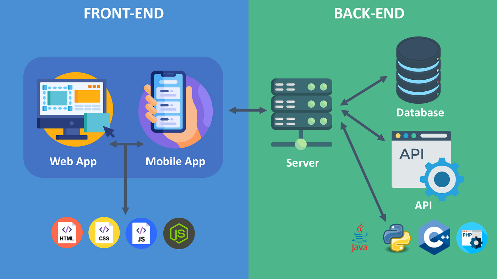

## **1. Основные функции Back-End**
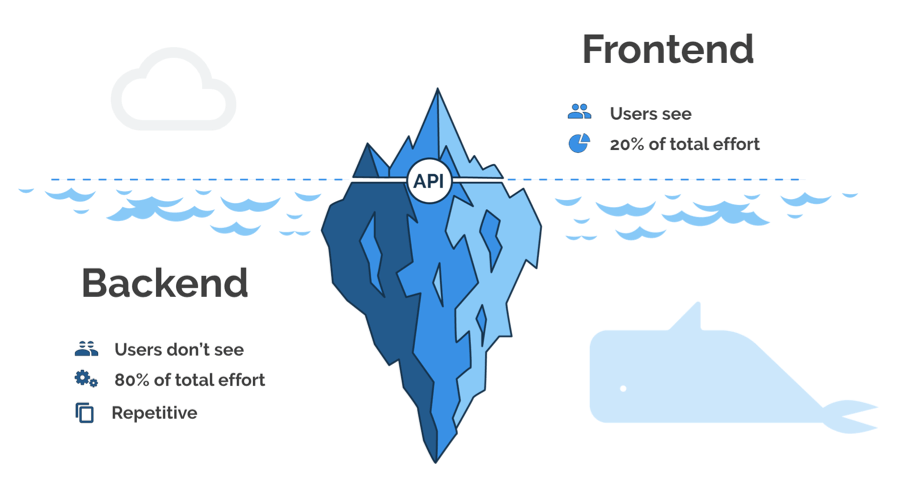
- Бизнес-логика
- Кибербезопасность
- Производительность и масштабируемость
- Мониторинг
- Работа по разным протоколам(http-Hyper Text Transfer Protocol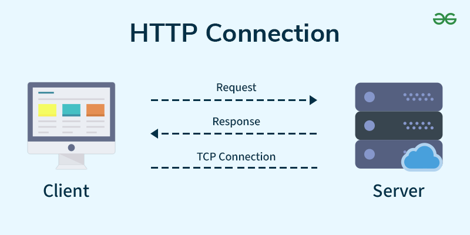, gRPC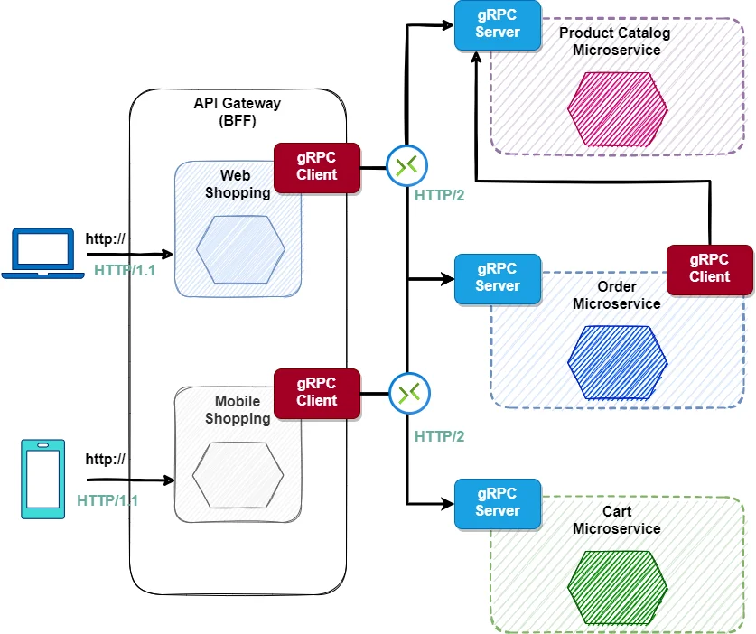, Ws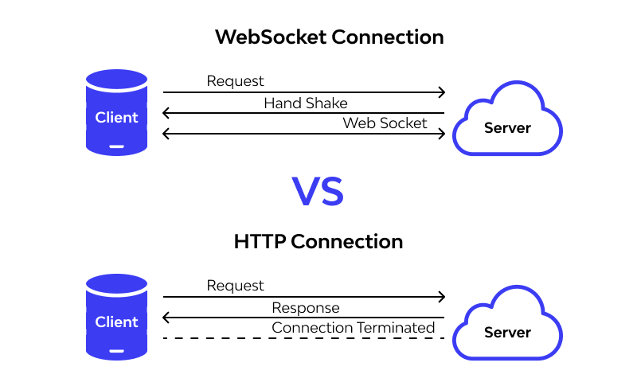, GraphQL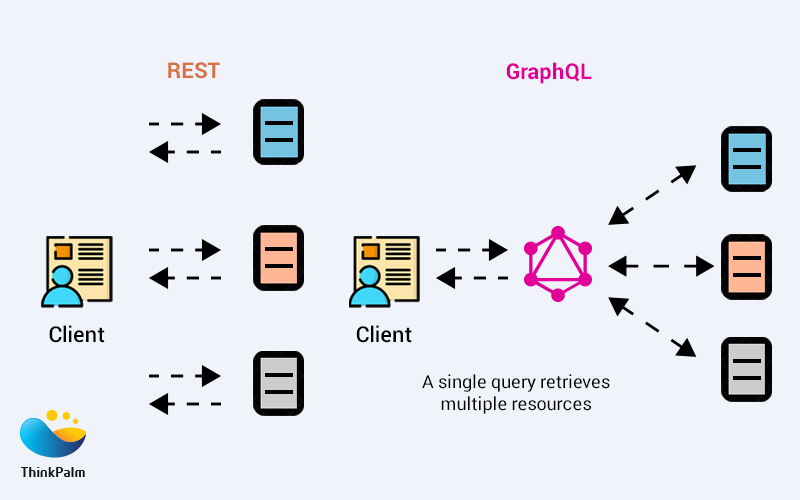, etc)
- Интеграции:
  - Интеграция с клиентскими частями (Front-End, Mobile, Desktop и любые устройства, работающие онлайн)
  - Интеграция с другими бэкендами
  - Интеграция с базами данных

## **2. Технологический стек Python Back-End**
- **Язык программирования** — Python.
- **[Модули и фреймворки](https://pypi.org/)**

- # **[Database](https://db-engines.com/en/ranking):** — это структурированное хранилище данных, организованное так, чтобы обеспечивать удобное хранение, доступ, управление и модификацию информации.

## 🔥 Основные компоненты базы данных
1. **Данные** – сама информация, хранящаяся в базе.
2. **Схема** – структура данных (таблицы, индексы, связи и т. д.).
3. **СУБД (Система Управления Базами Данных)** – программное обеспечение, управляющее БД.

## ⚡️ Виды баз данных
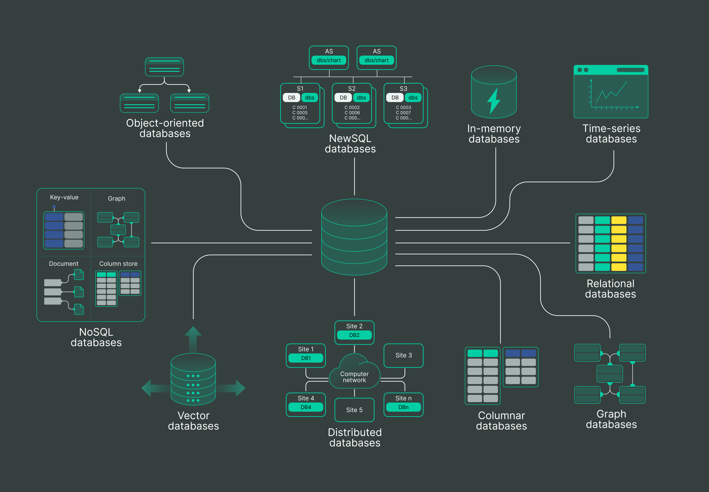
1. Реляционные базы данных (Relational databases) - PostgreSQL 
2. Объектно-ориентированные базы данных (Object-oriented databases) - MongoDB
3. NoSQL базы данных (NoSQL databases):
   - 3.1 Key-value - Redis
   - 3.2 Document - MongoDB
   - 3.3 Column store - ClickHouse 
   - 3.4 Graph - Neo4j
4. NewSQL базы данных (NewSQL databases) - CockroachDB
5. Базы данных на основе векторов (Vector databases) - Pinecone
6. Распределённые базы данных (Distributed databases) - Cassandra
7. Базы данных в памяти (In-memory databases) - Redis
8. Базы данных временных рядов (Time-series databases) - ClickHouse

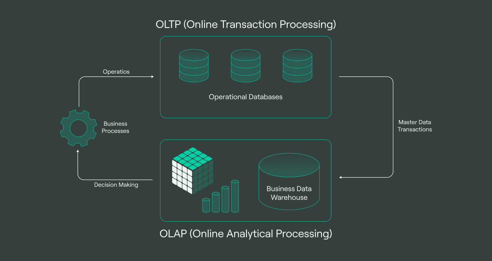
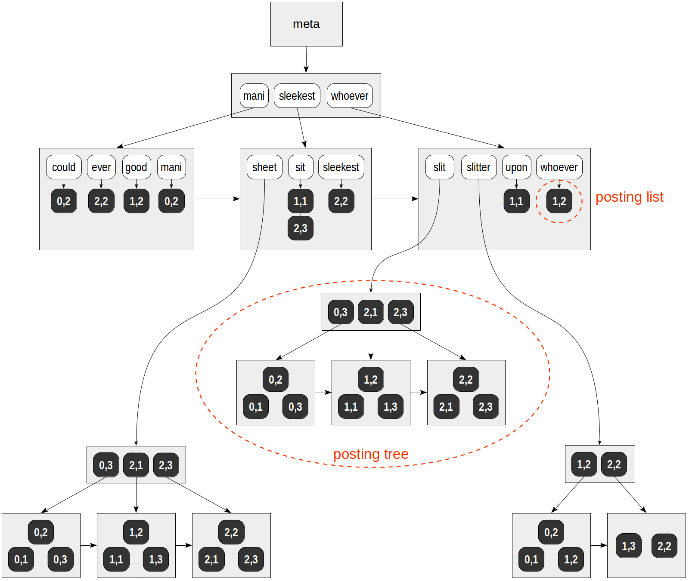
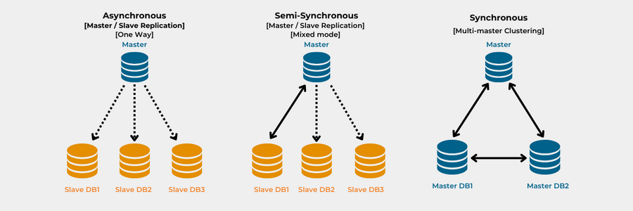
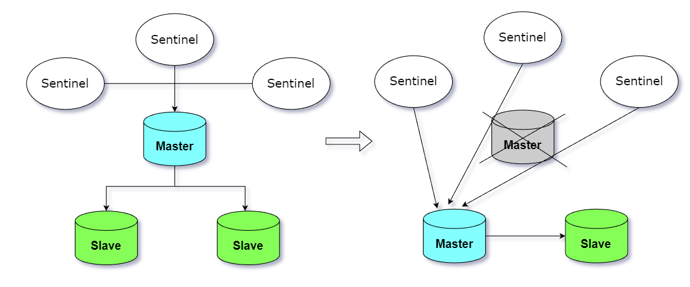
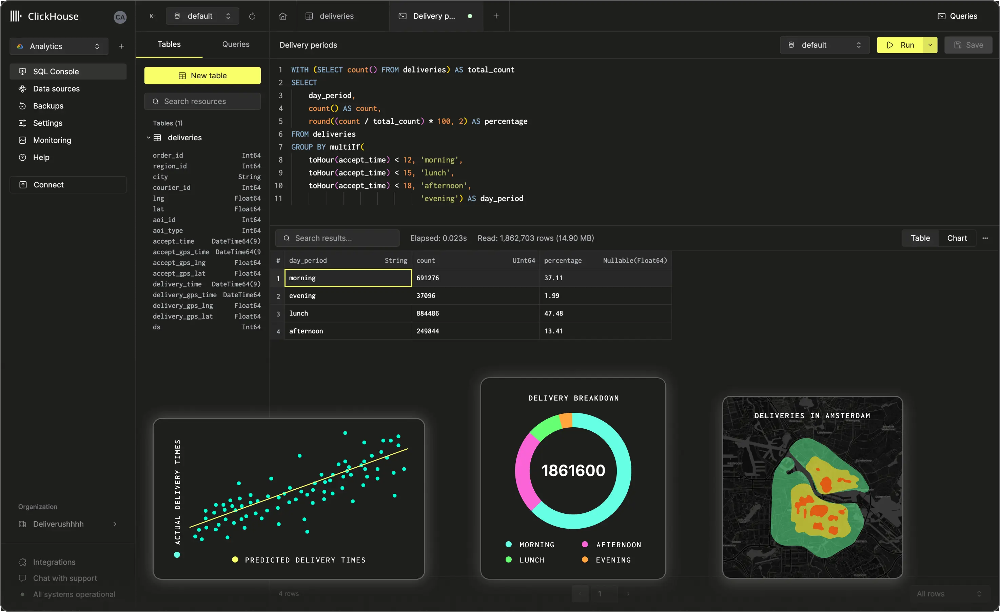
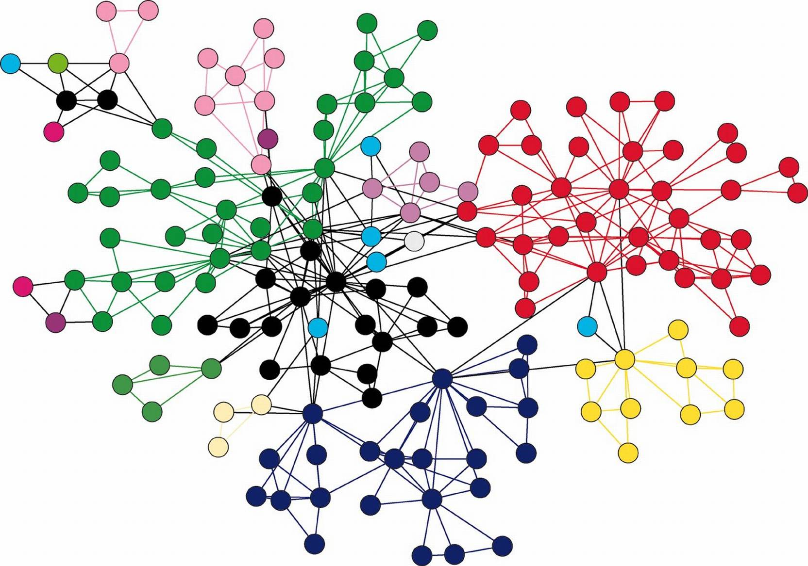
[Example of Graph Database Visualization](https://exploring-data.com/vis/programming-languages-influence-network-2014/)

## **Транзакции в БД:**
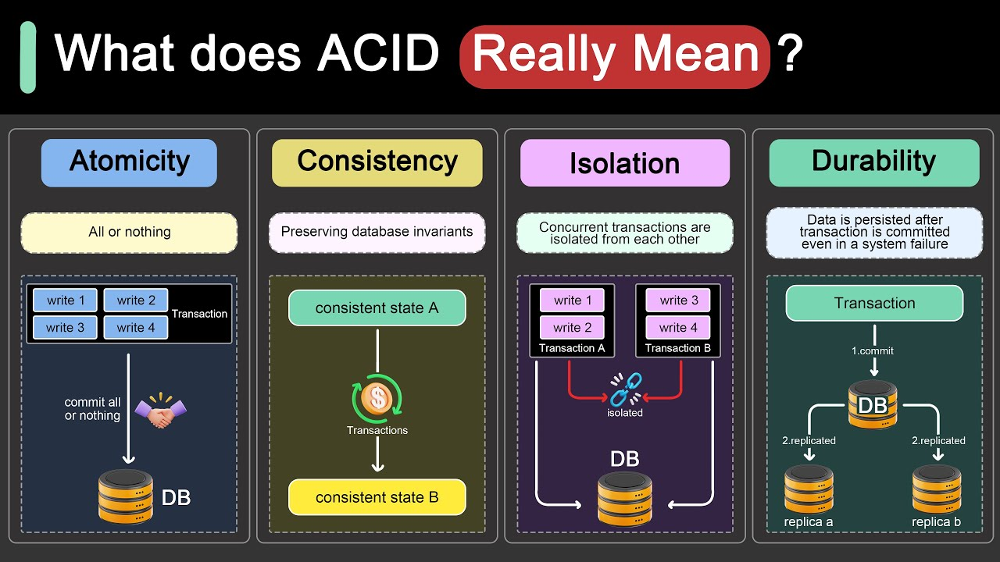
**Транзакция** – это последовательность операций, которая выполняется как единое целое.
Принципы транзакций называются **ACID**:
- **Atomicity (Атомарность)** – либо все операции выполнены, либо ни одна.
- **Consistency (Согласованность)** – БД всегда остается в корректном состоянии.
- **Isolation (Изоляция)** – параллельные транзакции не мешают друг другу.
- **Durability (Долговечность)** – данные не теряются при сбоях.

## 🚫 Заблуждения о Типах баз Данных
### 1. **Реляционные базы данных (Relational Databases)**  
   - **Заблуждение:** SQL — это база данных.  
   - **Опровержение:** SQL — это язык запросов, а база данных — это место хранения данных. Разные СУБД (PostgreSQL, MySQL) используют SQL, но сами базы данных — это таблицы и связи между ними.  
### 2. **Объектно-ориентированные базы данных (Object-Oriented Databases)**  
   - **Заблуждение:** Это то же самое, что документные базы.  
   - **Опровержение:** В объектно-ориентированных базах данные хранятся в виде реальных объектов, как в ООП, а в документных — в формате JSON/BSON без строгой структуры классов.  
### 3. **NoSQL базы данных (NoSQL Databases)**  
   #### 3.1 **Key-Value базы данных**  
   - **Заблуждение:** Это просто кэш.  
   - **Опровержение:** Хотя key-value базы часто используют как кэш, они также могут служить основными хранилищами данных, например, для сессий пользователей.  
   #### 3.2 **Document базы данных**  
   - **Заблуждение:** Это реляционные базы без SQL.  
   - **Опровержение:** В документных базах нет таблиц и строгих схем. Они гибкие, но из-за этого сложнее выполнять сложные аналитические запросы.  
   #### 3.3 **Column-store базы данных**  
   - **Заблуждение:** Это просто реляционная база данных.  
   - **Опровержение:** Колоночные базы оптимизированы для аналитики, они быстрее работают с агрегатными функциями, но хуже подходят для оперативных транзакций.  
   #### 3.4 **Graph базы данных**  
   - **Заблуждение:** Это обычная база данных, только с отношениями.  
   - **Опровержение:** В реляционных базах связи реализуются через внешние ключи, а в графовых базах — через вершины и рёбра, что позволяет строить сложные взаимосвязи быстрее.  
### 4. **NewSQL базы данных (NewSQL Databases)**  
   - **Заблуждение:** Это просто улучшенные реляционные базы.  
   - **Опровержение:** Они совмещают строгие транзакции (ACID) и горизонтальное масштабирование, что не всегда возможно в традиционных SQL-базах.  
### 5. **Базы данных на основе векторов (Vector Databases)**  
   - **Заблуждение:** Это просто ещё один вид NoSQL.  
   - **Опровержение:** Векторные базы заточены под быстрый поиск по многомерным пространствам, например, для нейросетей и рекомендательных систем.  
### 6. **Распределённые базы данных (Distributed Databases)**  
   - **Заблуждение:** Они всегда быстрее обычных.  
   - **Опровержение:** Из-за распределённой архитектуры могут быть задержки при синхронизации данных между узлами, поэтому они не всегда подходят для высокочастотных транзакций.  
### 7. **Базы данных в памяти (In-Memory Databases)**  
   - **Заблуждение:** Данные исчезают после выключения сервера.  
   - **Опровержение:** Многие in-memory базы умеют сохранять данные на диск, используя снапшоты и журналы изменений.  
### 8. **Базы данных временных рядов (Time-Series Databases)**  
   - **Заблуждение:** Временные ряды можно хранить в обычной SQL-базе.  
   - **Опровержение:** Специализированные базы оптимизированы для быстрой вставки и анализа временных данных, тогда как обычные SQL-базы теряют производительность на таких задачах.  

### 📊 Сравнение баз данных
| **Название**    | **ACID** | **Архитектура**         | **Плюсы**                          | **Минусы**                    | **Ключевые кейсы**       | **Масштабируемость** | **Скорость работы** |
|---------------|---------|----------------------|--------------------------------|-----------------------------|----------------------|-----------------|----------------|
| **PostgreSQL** | ✅ Полный | Реляционная (SQL) | 🔹 Мощный SQL 🔹 Надежность | ⚠️ Сложность масштабирования ⚠️ Высокая нагрузка на запись | 🔹 Финансы 🔹 Аналитика | 🔹 Вертикальная сложная 🔹 Горизонтальная (шардинг, репликация) | 🔹 Средняя (зависит от индексов и запросов) |
| **MongoDB**    | ⚠️ ACID только внутри одной документа | Документо-ориентированная (NoSQL) | 🔹 Гибкость 🔹 Хорошая горизонтальная масштабируемость | ⚠️ Индексы критичны ⚠️ Большое потребление памяти | 🔹 Big Data 🔹 Логи | 🔹 Отличная горизонтальная (шардирование) | 🔹 Высокая на чтение (при хороших индексах) |
| **Redis**      | ⚠️ Только при использовании AOF + RDB | In-memory, key-value | 🔹 Максимальная скорость 🔹 Гибкость (pub/sub, Lua, TTL(Time To Live)) | ⚠️ Данные теряются без надежной персистенции ⚠️ Ограничен RAM | 🔹 Кэш 🔹 Очереди | 🔹 Горизонтальная (кластеризация) | 🔹 Экстремально высокая |
| **ClickHouse** | ⚠️ Только на уровне блока данных | Колонночное хранилище (OLAP) | 🔹 Лучшая скорость аналитики 🔹 Отличное сжатие данных | ⚠️ Плохая поддержка транзакций ⚠️ Ограниченные возможности обновления данных | 🔹 BI 🔹 Метрики | 🔹 Хорошая горизонтальная (шардирование, репликация) | 🔹 Очень высокая на аналитические запросы |
| **Neo4j**      | ⚠️ ACID в пределах одного узла (ограниченная) | Графовая (NoSQL) | 🔹 Оптимизирован для графовых запросов 🔹 Гибкость связей | ⚠️ Сложно горизонтально масштабировать ⚠️ Потребляет много памяти | 🔹 Соцсети 🔹 Маршрутизация | 🔹 Ограниченная горизонтальная | 🔹 Высокая при небольших данных |
| **CockroachDB** | ✅ Полный | Распределенная (NewSQL) | 🔹 Автошардинг 🔹 SQL-совместимость (PostgreSQL) | ⚠️ Высокие накладные расходы ⚠️ Нет встроенного JSONB | 🔹 Глобальные системы 🔹 HA-сервисы | 🔹 Отличная горизонтальная (Multi-Region) | 🔹 Средняя (выше PostgreSQL, но уступает NoSQL) |
| **Pinecone**   | ❌ Нет | Векторный поиск | 🔹 Быстрый поиск по embeddings 🔹 AI-оптимизированный | ⚠️ Узкая специализация ⚠️ Высокая стоимость | 🔹 AI 🔹 Поиск похожих объектов | 🔹 Отличная горизонтальная | 🔹 Очень высокая |
| **Cassandra**  | ⚠️ ACID на уровне одной строки | Распределенная (NoSQL) | 🔹 Высокая скорость записи 🔹 Отказоустойчивость | ⚠️ Нет сложных SQL-запросов ⚠️ Отсутствуют JOIN'ы | 🔹 Big Data 🔹 Логирование | 🔹 Отличная горизонтальная (Multi-Region) | 🔹 Высокая на запись, низкая на сложные запросы |

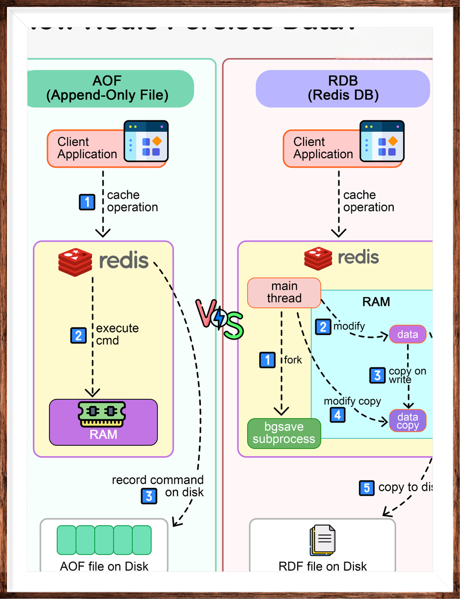

## 🚫 Заблуждения о СУБД:
### **1. Реляционные базы данных (Relational databases) – PostgreSQL**  
- 🛑 **Заблуждение:** "PostgreSQL – это просто улучшенный MySQL."  
- ✅ **Опровержение:** PostgreSQL и MySQL – это разные СУБД. PostgreSQL ориентирован на расширенные SQL-возможности, транзакции и сложные запросы, а MySQL – на скорость простых операций.  
### **2. Объектно-ориентированные базы данных (Object-oriented databases) – MongoDB**  
- 🛑 **Заблуждение:** "MongoDB – это просто NoSQL."  
- ✅ **Опровержение:** MongoDB – это документно-ориентированная база, но с элементами объектно-ориентированного программирования (вложенные структуры, схемы данных).  
- 🛑 **Заблуждение:** "MongoDB лучше SQL для всех случаев."  
- ✅ **Опровержение:** MongoDB удобна для неструктурированных данных, но SQL-БД лучше подходят для транзакционных систем, строгих связей между данными.  
### **3. NoSQL базы данных (NoSQL databases)**  
  - 🔹 **3.1 Key-value – Redis**  
    - 🛑 **Заблуждение:** "Redis – это только кэш."  
    - ✅ **Опровержение:** Redis поддерживает персистентность (RDB, AOF), списки, множества и может использоваться как основная БД.  
  - 🔹 **3.2 Document – MongoDB**  
    - 🛑 **Заблуждение:** "MongoDB быстрее SQL в 100 раз."  
    - ✅ **Опровержение:** Вставка и поиск в MongoDB могут быть быстрее, но сложные аналитические запросы SQL-БД выполняют эффективнее.  
  - 🔹 **3.3 Column store – ClickHouse**  
    - 🛑 **Заблуждение:** "ClickHouse – это просто ещё одна SQL база."  
    - ✅ **Опровержение:** ClickHouse – аналитическая БД с колонночным хранением, оптимизированная для агрегации данных, а не для CRUD-операций.  
  - 🔹 **3.4 Graph – Neo4j**  
    - 🛑 **Заблуждение:** "Neo4j можно заменить реляционной БД."  
    - ✅ **Опровержение:** Графовые базы эффективнее работают с узлами и связями, тогда как SQL-БД сложнее обрабатывать графовые структуры.  
### **4. NewSQL базы данных (NewSQL databases) – CockroachDB**  
- 🛑 **Заблуждение:** "NewSQL – это просто новая версия SQL."  
- ✅ **Опровержение:** NewSQL сочетает реляционную модель с горизонтальным масштабированием, что делает её ближе к NoSQL по архитектуре.  
### **5. Базы данных на основе векторов (Vector databases) – Pinecone**  
- 🛑 **Заблуждение:** "Pinecone – это просто NoSQL."  
- ✅ **Опровержение:** Pinecone оптимизирована для поиска по векторным представлениям данных (например, Embeddings в AI), что делает её уникальной.  
### **6. Распределённые базы данных (Distributed databases) – Cassandra**  
- 🛑 **Заблуждение:** "Cassandra быстрее PostgreSQL."  
- ✅ **Опровержение:** Cassandra быстрее при массовых вставках и чтении, но PostgreSQL лучше для сложных транзакций и целостности данных.  
### **7. Базы данных в памяти (In-memory databases) – Redis**  
- 🛑 **Заблуждение:** "Данные в Redis не сохраняются."  
- ✅ **Опровержение:** Redis поддерживает сохранение данных на диск (RDB, AOF), но для критичных данных лучше использовать персистентные БД.  
### **8. Базы данных временных рядов (Time-series databases) – ClickHouse**  
- 🛑 **Заблуждение:** "Можно просто использовать SQL."  
- ✅ **Опровержение:** Временные ряды требуют специальных индексов и сжатия данных, что делает ClickHouse эффективнее обычных SQL-БД.  

## 🔥 Итог: Почему базы данных критичны для разработки?
- В мире backend-разработки база данных — это фундамент, на котором строятся приложения. Без надежного хранилища данных системы становятся уязвимыми, медленными и трудно масштабируемыми.
- 📌 Выбор базы данных — это всегда баланс между надежностью, производительностью и удобством работы с данными. Ошибка в выборе может стоить масштабируемости всего проекта.

---
---
---

- # **Cybersecurity:**
— это защита информационных систем, данных и сетей от кибератак, утечек и несанкционированного доступа.

## **Основные направления кибербезопасности**
1. **Сетевая безопасность** – защита сетей (Wi-Fi, корпоративные сети, интернет). Использует firewall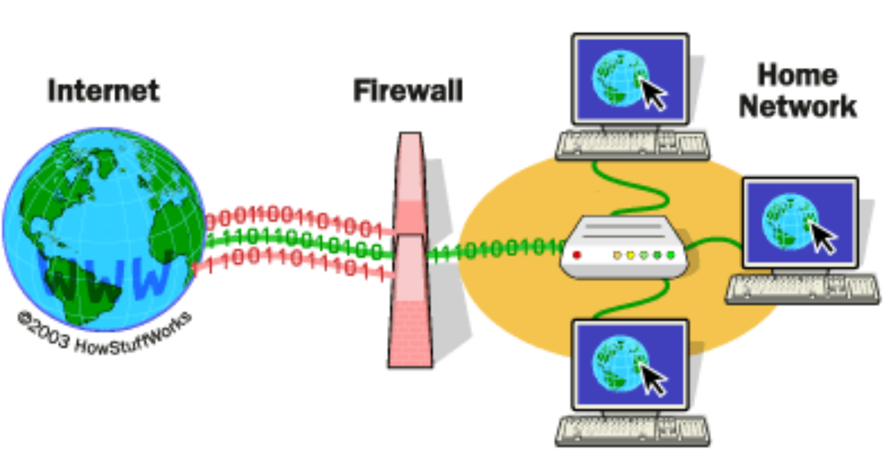, VPN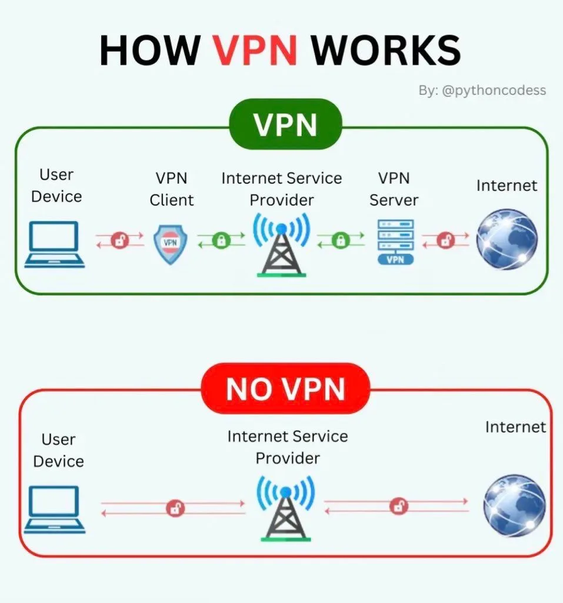, IDS(Intrusion detection systems)/IPS(intrusion prevention systems)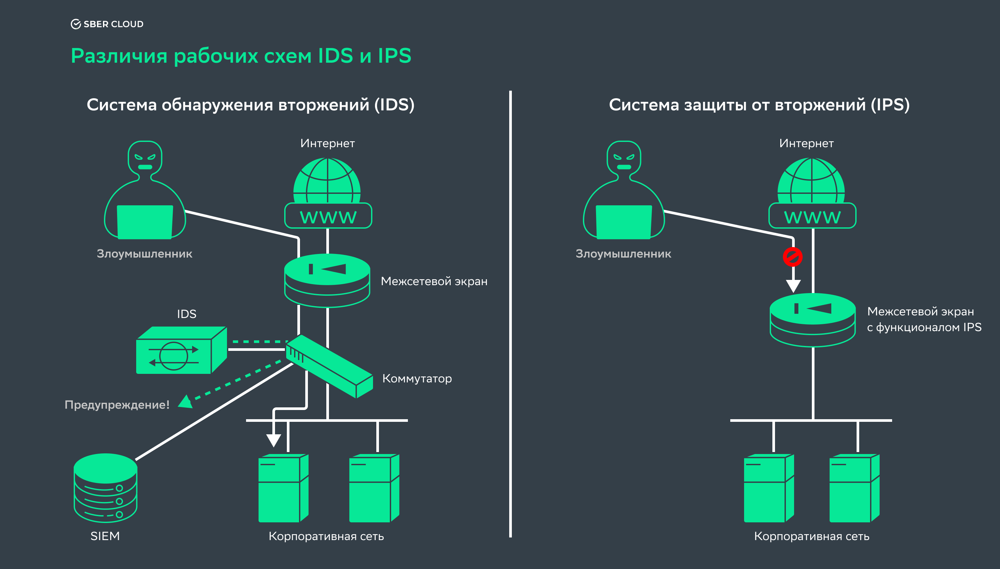.
2. **Безопасность приложений** – защита программ от уязвимостей (SQL-инъекции, XSS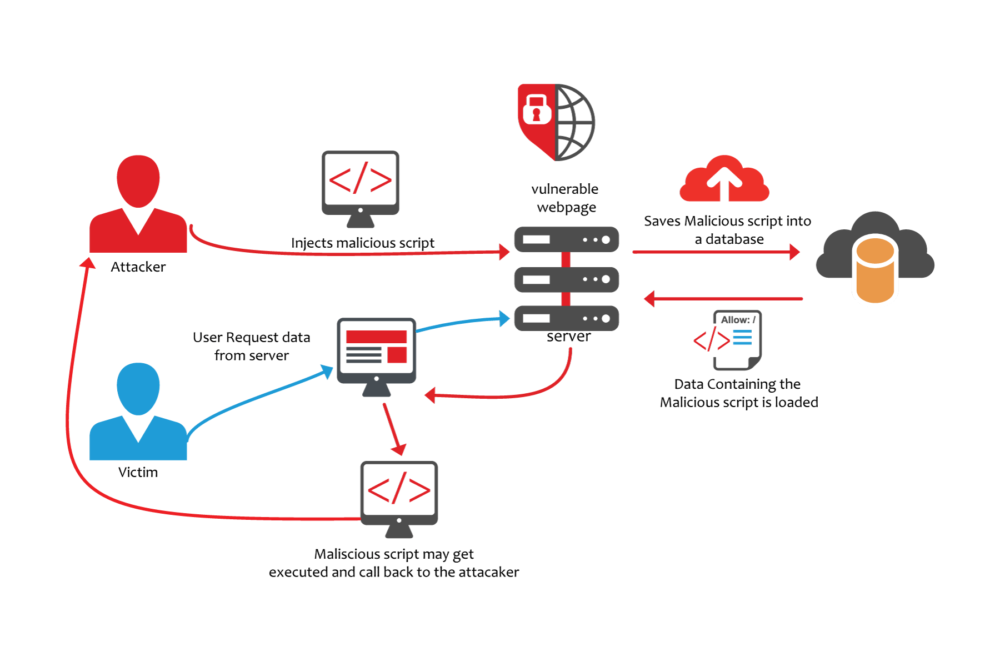). OWASP(Open Worldwide Application Security Projec) Top 10 – список главных угроз.
3. **Безопасность данных** – защита хранения и передачи информации (шифрование, резервное копирование).
4. **Операционная безопасность** – защита внутренних процессов организации (аудит логов, контроль доступа).
5. **Обучение пользователей** – человеческий фактор — главный риск (фишинг, слабые пароли).
6. **Обнаружение и реагирование на инциденты** – SOC (Security Operations Center), SIEM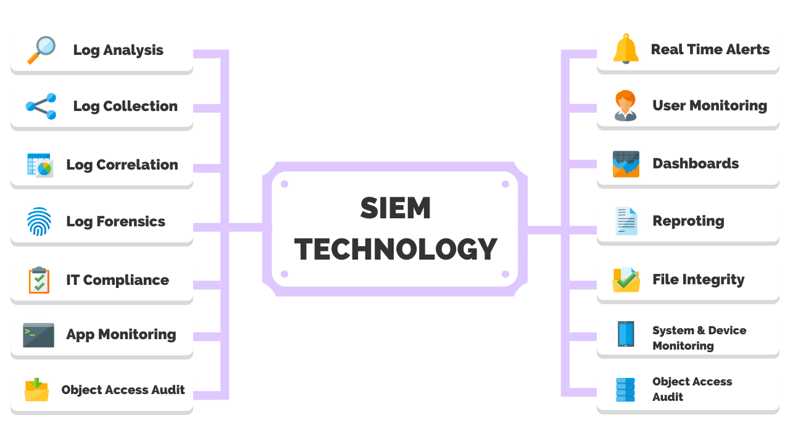 (анализ событий безопасности).
7. **Безопасность облачных технологий** – защита данных в облачных сервисах (AWS, Azure, Google Cloud).
8. **Критическая инфраструктура** – защита промышленных систем (SCADA
(Supervisory Control and Data Acquisition-Контроль над надзором и сбором данных)(Supervisory Control and Data Acquisition-Контроль над надзором и сбором данных)SCADA Hacking result, 
IoT- многие из них уязвимы к кибератакам, ICS(industrial control system)).

## **Ключевые угрозы**
- Вредоносное ПО (Malware) – вирусы, трояны, шифровальщики.
- Фишинг – обман пользователей для кражи данных.
- DDoS-атаки – перегрузка серверов, чтобы вывести их из строя.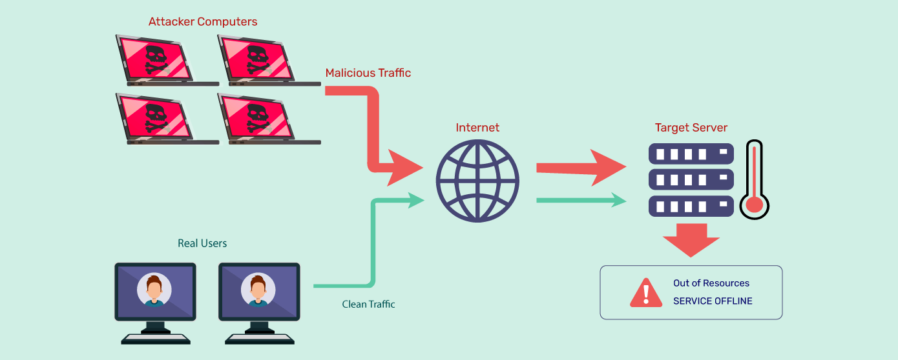(malicious traffic-вредоносный трафик)
- Взлом паролей – брутфорс, подбор, утечки.
- Эксплойты – использование уязвимостей в ПО.

## **Основные методы защиты**
- ✅ **Аутентификация и контроль доступа** – JWT, OAuth2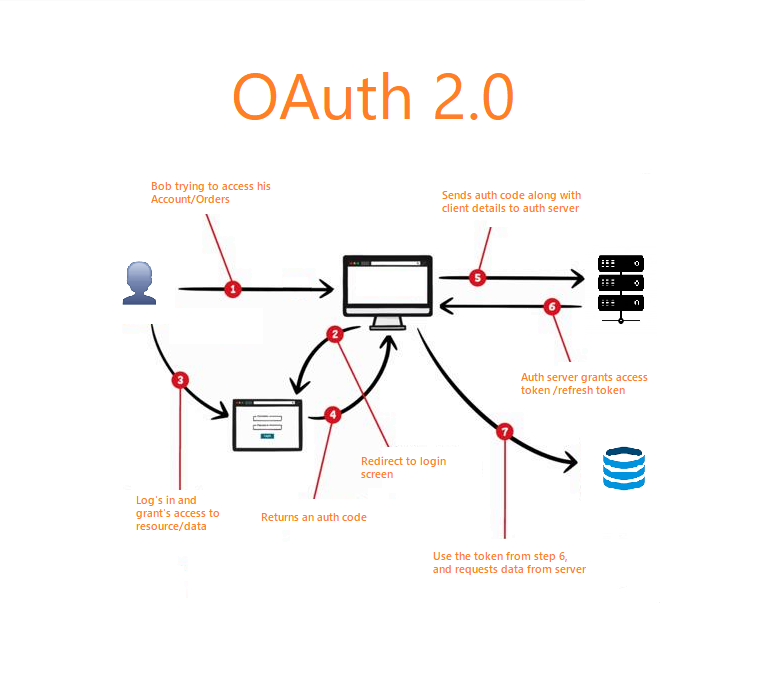, сложные пароли, 2FA, роль-based access control (RBAC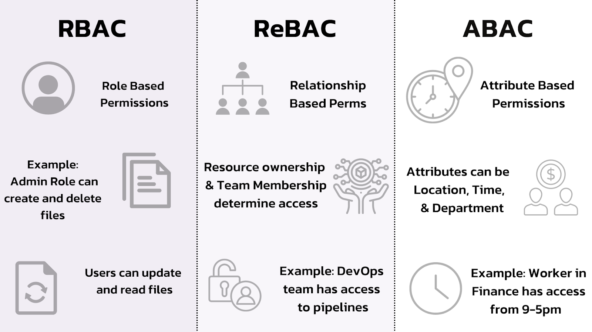).
- ✅ **Шифрование** – шифрование паролей (bcrypt, Argon2), TLS(Transport Layer Security), SSL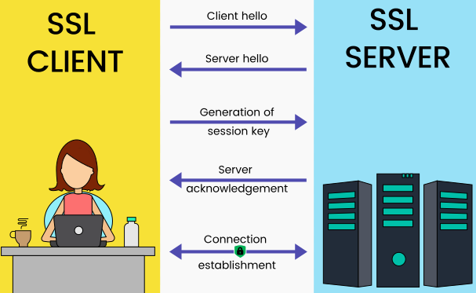, AES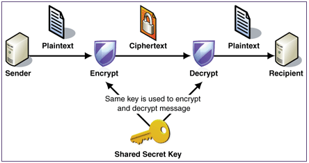(Advanced Encryption Standard проще говоря симметричное шифрование), RSA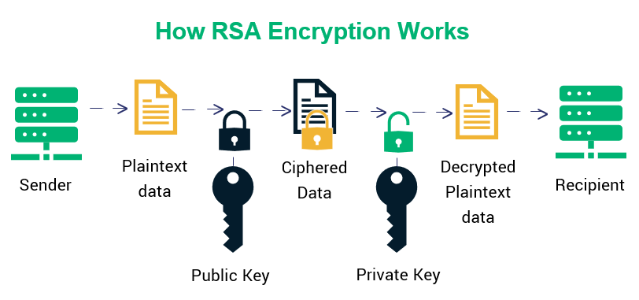(Расшифровка выдает фамилии его создателей), PGP(Pretty Good Privacy) для защиты данных.
- ✅ **Обновление ПО** – патчи закрывают уязвимости.
- ✅ **Мониторинг и аудит** – SIEM-системы анализируют логи.
- ✅ **Обучение сотрудников** – безопасность зависит от осведомленности людей.

## **Заблуждения про кибербезопасность**
- "Антивирус защитит от всех угроз" 🚫 нет, он обнаруживает лишь известные угрозы и не спасет от фишинга или уязвимостей в ПО.
- "Простой пароль — не проблема" 🚫 пароли вроде 123456 или qwerty взламываются мгновенно, используйте сложные и уникальные.
- "Меня не взломают, я не представляю ценности" 🚫 атаки автоматизированы, злоумышленники охотятся даже на обычных пользователей.
- "VPN делает меня анонимным" 🚫 он лишь шифрует трафик, но ваш провайдер, сайты и сервисы все равно могут отслеживать вас.
- "Облако — это гарант безопасности" 🚫 даже крупнейшие облачные платформы подвержены утечкам, важно правильно настраивать доступ и шифровать данные.

## **Вывод**
Кибербезопасность — это комплекс мер по защите информации и систем. Она требует постоянного мониторинга, обучения и технических решений. Не существует 100% защиты, но грамотный подход снижает риски.

- **Логирование** — `logging`, Sentry, ELK Stack.

---
---
---

- # **Testing:**– это процесс проверки программного обеспечения (ПО) на соответствие требованиям, поиск ошибок и обеспечение его качества.

## **1. Основные цели тестирования:**
- **Обнаружение ошибок** – выявление дефектов, которые могут привести к сбоям.
- **Подтверждение соответствия требованиям** – проверка, что ПО делает именно то, что задумано.
- **Повышение качества** – обеспечение стабильности, надежности и удобства использования.
- **Снижение рисков** – предотвращение серьезных багов на продакшене, которые могут привести к финансовым потерям и негативной репутации.

## Направления где применяется тестирование:
- Где тестирование критически важно:  
  - **Back-End** – API, бизнес-логика, нагрузка, интеграция сервисов. Без тестов – хаос.  
  - **Database** – целостность, производительность, миграции. Ошибки здесь – потеря данных.  
  - **DevOps** – CI/CD, инфраструктура, безопасность. Без тестов – риски падения продакшена.  
  - **Cybersecurity** – пентесты, fuzzing, защита от атак. Без тестов – дыры в безопасности.  
  - **BlockChain / Web3 / Smart Contracts** – аудит, fuzzing. Ошибки тут = потеря миллионов.  
- Где тестирование нужно, но не критично:  
  - **BOT** – тестирование логики, API, NLP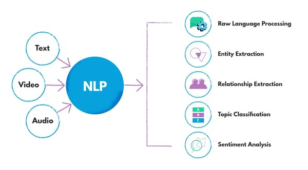. Ошибки – просто глупый бот.  
  - **Front-End / Mobile / Desktop** – UI, e2e((end to end)). Без тестов – баги, но не катастрофа.  
  - **AI / Data Science** – валидация данных, корректность моделей. Ошибки – неточные предсказания.  
  - **Embedded & Digital Electronics** – тесты прошивок, железа. Ошибки – бракованное устройство.  
- Где тестирование вторично:  
    - **Design** – UX/UI, A/B тесты. Ошибки влияют на конверсии, но не критично.  
### **Вывод**: тестирование – основа стабильности в backend, security, DevOps и блокчейне. В остальном – важно, но без него система не развалится мгновенно.

## **2. Основные виды тестирования:**
1. ** Уровни тестирования**  
- **Юнит-тестирование** – проверка отдельных функций.  
- **Интеграционное тестирование** – проверка связей между модулями.  
- **Системное тестирование** – проверка всей системы целиком.  
- **Приемочное тестирование** – соответствует ли продукт требованиям.  
2. ** Доступ к коду**  
- **Белый ящик** – тестирование с анализом кода.  
- **Черный ящик** – без знания кода.  
- **Серый ящик** – частичный доступ к коду.  
3. ** Метод выполнения**  
- **Ручное** – тестировщик выполняет вручную.  
- **Автоматизированное** – тесты выполняются скриптами.  
4. ** Функциональное тестирование**  
- **Smoke** – базовая проверка работоспособности.  
- **Sanity** – быстрая проверка после фиксов.  
- **Регрессионное** – не сломалось ли старое после изменений.  
- **API** – проверка REST/gRPC API/Ws/GraphQL/etc.  
- **UI** – тестирование интерфейса.  
5. ** Нефункциональное тестирование**  
- **Производительность**:  
  - *Нагрузочное* – стандартная нагрузка.  
  - *Стрессовое* – экстремальные условия.  
  - *Долговременное* – длительная работа.  
  - *Объемное* – большие данные.  
- **Безопасность**:  
  - *Пентест* – имитация атак.  
  - *Фаззинг* – случайные данные на входе.  
- **Юзабилити** – удобство работы.  
- **Совместимость** – работа на разных платформах.  
- **Доступность** – адаптация для людей с ограниченными возможностями.  
6. ** Специализированные тесты**  
- **A/B тестирование** – сравнение двух версий.  
- **Восстановление** – работоспособность после сбоя.  
- **Установка и обновление** – корректность инсталляции.  
- **Отказоустойчивость** – поведение при сбоях.  

## **3. Основные заблуждения о тестировании**
- **“Тестирование не нужно, если код хорош”** 🚫 даже идеальный код может вести себя непредсказуемо из-за сторонних зависимостей.
- **“Тестирование – это только поиск багов”** 🚫 на самом деле, это еще и подтверждение корректной работы.
- **“Автоматизация заменит тестировщиков”** 🚫 автоматизация ускоряет процесс, но не заменяет человека, особенно при UX и security тестах.
- **“Тестировщик – это простая профессия”** 🚫 тестировщик должен разбираться в архитектуре ПО, писать скрипты, понимать бизнес-логику и искать критические сценарии.
- "Тесты гарантируют отсутствие багов" 🚫 Юнит-тестов недостаточно. Нужны интеграционные, нагрузочные и e2e-тесты, чтобы поймать реальные проблемы.

## **4. Почему тестирование важно?**
- Позволяет сократить **затраты на исправление багов** (чем позже найден баг, тем труднее его исправить и тем дороже он обходится).
- Повышает **надежность** ПО, снижает вероятность краха системы.
- Улучшает **пользовательский опыт** (UX), что важно для бизнеса.
- Способствует быстрому **внедрению новых фич** без страха сломать систему.

**Вывод:** Тестирование – это не просто поиск багов, а важный процесс обеспечения качества программного обеспечения.

---
---
---

- **ORM** - SQLAlchemy, Django ORM.
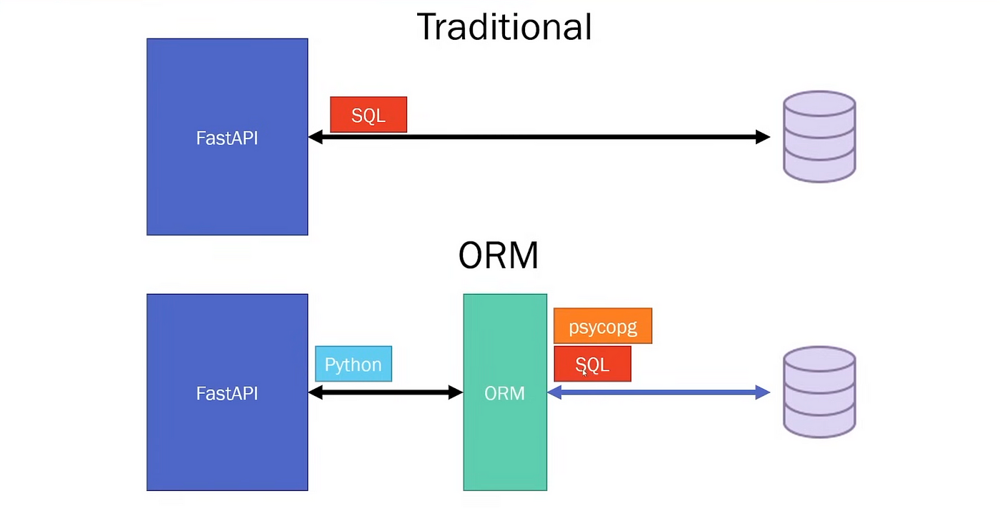

## **3. Архитектурные подходы**
1. **Монолит (Monolith)**  
   - **Описание**: Единый блок: логика, БД, интерфейс.  
   - **Плюсы**: Простота разработки, тестирования, развертывания.  
   - **Минусы**: Сложность масштабирования и поддержки.  
   - **Когда использовать**: Небольшие проекты или стартапы.  

2. **Микросервисы (Microservices)**  
   - **Описание**: Независимые сервисы, каждый решает свою задачу.  
   - **Плюсы**: Гибкость, масштабируемость, независимость технологий.  
   - **Минусы**: Сложность управления, высокие накладные расходы.  
   - **Когда использовать**: Крупные проекты с высокой нагрузкой.  
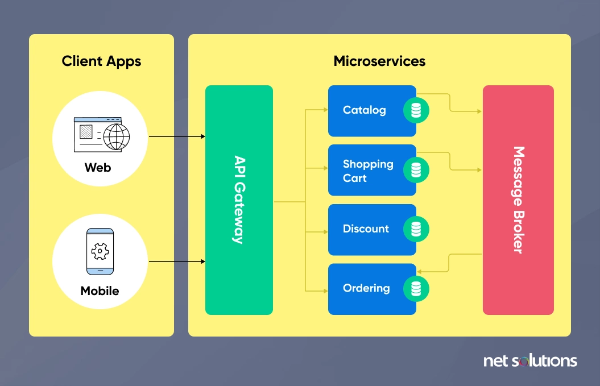
3. **Бессерверная (Serverless)**  
   - **Описание**: Код выполняется в облаке без управления серверами (например, AWS Lambda).  
   - **Плюсы**: Нет управления инфраструктурой, оплата за использование.  
   - **Минусы**: Ограничения по времени выполнения, vendor lock-in.  
   - **Когда использовать**: Кратковременные задачи или события.  
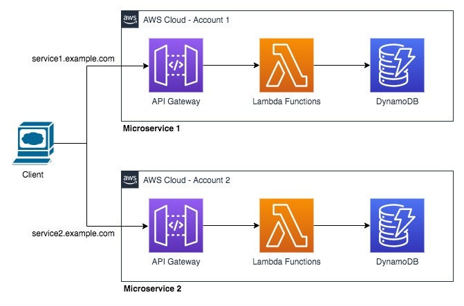
4. **Событийно-ориентированная (Event-Driven)**  
   - **Описание**: Компоненты обмениваются сообщениями через брокеры (Kafka, RabbitMQ).  
   - **Плюсы**: Отзывчивость, слабая связанность компонентов.  
   - **Минусы**: Сложность отладки и проектирования.  
   - **Когда использовать**: Системы реального времени или сложные workflows.  
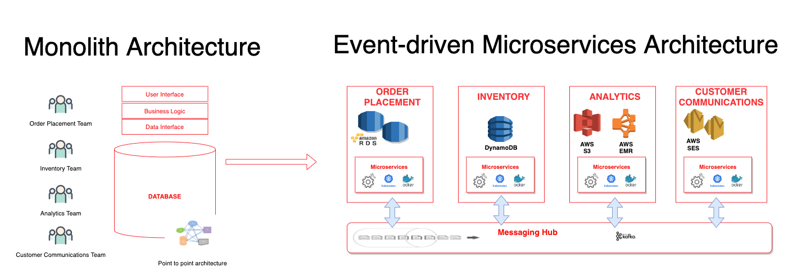

**Итог**:  
- **Монолит** — просто, но не масштабируется.  
- **Микросервисы** — мощно, но сложно.  
- **Serverless** — удобно, но ограничено.  
- **Event-Driven** — гибко, но требует усилий.  
Выбор зависит от масштаба, нагрузки и команды.

## **4. Частые заблуждения о Back-End**
1. "Микросервисы всегда лучше монолита" 🔴 Монолит проще, дешевле и быстрее в разработке и деплое. Микросервисы оправданы только при больших нагрузках и сложных командах.
2. "REST – лучший API-подход" 🔴 GraphQL, gRPC и WebSockets могут быть эффективнее:
- GraphQL — когда нужно гибко получать данные.
- gRPC — когда важна высокая скорость и бинарные данные.
- WebSockets — когда требуется real-time.
3. "Backend – это просто серверная логика" 🔴 Backend-разработчик должен понимать базы данных, API, безопасность, архитектуру и DevOps-процессы.
4. "Кэширование всегда ускоряет систему" 🔴 Без правильной стратегии кэш может привести к устаревшим данным, багам и неожиданным нагрузкам.
5. "ORM всегда лучше raw SQL" 🔴 ORM удобен для CRUD, но чистый SQL быстрее и эффективнее в сложных запросах и оптимизации БД.
6. "JWT – лучший способ хранения сессий" 🔴 JWT хорош для stateless-аутентификации, но иногда серверные сессии или Redis безопаснее и проще.
7. "Безопасность обеспечена, если использовать HTTPS" 🔴 Помимо HTTPS важны защита БД (SQL-инъекции, XSS(Cross-Site Scripting), CSRF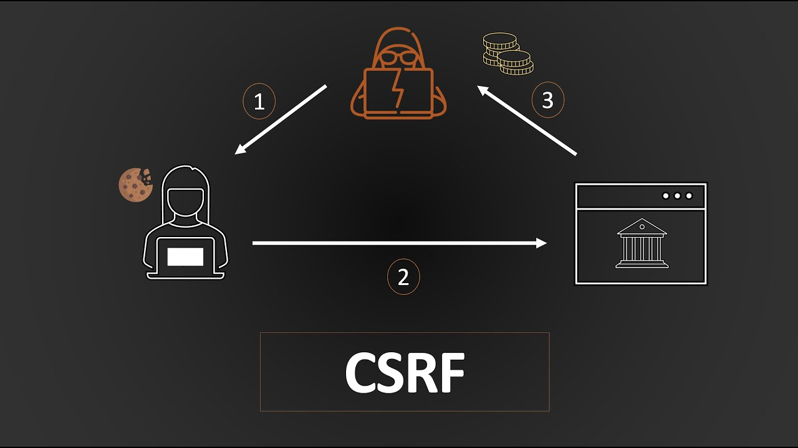(Cross-Site Request Forgery)), управление правами доступа (RBAC, OAuth2) и фильтрация входных данных.

## **5. Проблемы и вызовы Back-End**
- 🔴 **Производительность** — узкие места в БД, неоптимизированные запросы, плохая архитектура.
- 🔴 **Безопасность** — утечки данных, слабая аутентификация, уязвимости API.
- 🔴 **Масштабируемость** — сложность горизонтального масштабирования (особенно в монолитах).
- 🔴 **Сложность поддержки** — разрастание кода, технический долг.
- 🔴 **Выбор технологий** — неправильный выбор стека ведет к проблемам в будущем.

## **Вывод**
Back-End — это основа любого приложения работающего online, обеспечивающая логику, безопасность и работу с данными. Python — отличный выбор для Back-End за счёт простоты, богатой экосистемы и быстроты разработки, но он требует грамотного подхода к архитектуре и оптимизации.

---
---
---
# **DevOps -**
## — это культура, методология, практика, подход и набор инструментов для автоматизации, ускорения и повышения надежности процессов разработки (Dev) и эксплуатации (Ops).
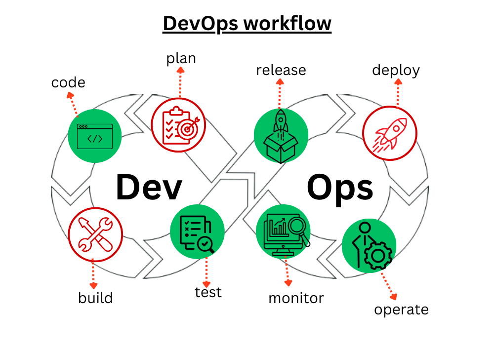

## **Виды серверов в DevOps**

### **1. VPS (Virtual Private Server)**  
- **Описание:** Виртуальный сервер с выделенными ресурсами на физическом хосте.  
- **Плюсы:**  
  - Дешевле VDS и облаков.  
  - Простота управления, подходит для новичков.  
- **Минусы:**  
  - Ограниченная производительность.  
  - Риск "шумного соседа" (если хост перегружен).  
- **Когда использовать:** Малые проекты, тестирование, стартапы.  
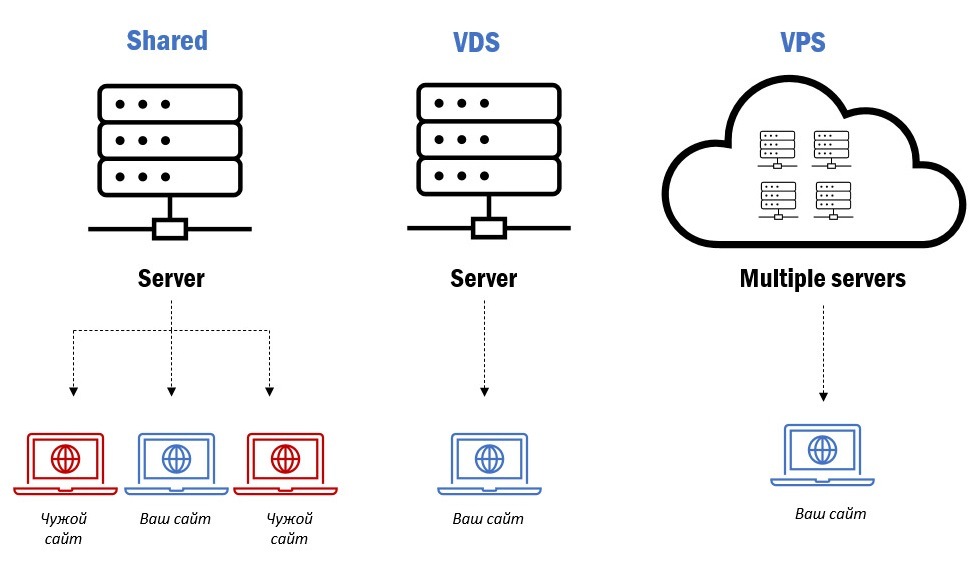
### **2. VDS (Virtual Dedicated Server)**  
- **Описание:** Виртуальный сервер с гарантированными ресурсами и изоляцией.  
- **Плюсы:**  
  - Выше производительность, чем у VPS.  
  - Полный контроль над сервером.  
- **Минусы:**  
  - Дороже VPS.  
  - Меньше гибкости, чем у облаков.  
- **Когда использовать:** Средние проекты, базы данных, приложения с умеренной нагрузкой.  
### **3. Облачные серверы (Cloud Servers)**  
- **Описание:** Виртуальные серверы в облачной инфраструктуре (AWS, Azure, GCP).  
- **Плюсы:**  
  - Высокая масштабируемость и гибкость.  
  - Интеграция с DevOps-инструментами (Terraform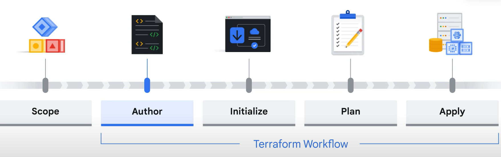, Kubernetes).  
- **Минусы:**  
  - Сложность управления и высокая стоимость при масштабировании.  
  - Зависимость от провайдера.  
- **Когда использовать:** Крупные проекты, CI/CD, высоконагруженные системы.  
### **4. Физические серверы (Bare Metal)**  
- **Описание:** Физическое оборудование без виртуализации.  
- **Плюсы:**  
  - Максимальная производительность.  
  - Полный контроль над железом.  
- **Минусы:**  
  - Высокая стоимость и сложность масштабирования.  
  - Требует времени на настройку и обслуживание. 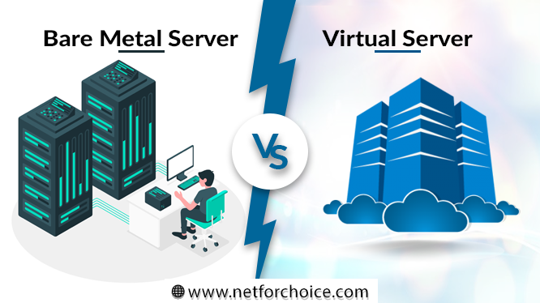 
- **Когда использовать:** Специализированные задачи (Big Data, высоконагруженные БД).  
### **Итог:**  
- **VPS:** Дешево, но ограничено.  
- **VDS:** Баланс цены и производительности.  
- **Облака:** Гибкость и масштабируемость, но дорого.  
- **Bare Metal:** Максимум мощности, но сложно и дорого.  

Выбор зависит от задач, бюджета и масштаба проекта!

## 📌 DevOps vs Традиционная разработка (устаревший стиль разработки)
- Сравнение работы без DevOps и с DevOps.
- ✅ Без DevOps: Разработчик пишет код → ждет админа → ошибки → долгий деплой.
- ✅ С DevOps: Код автоматически тестируется, деплоится, мониторится.

## 🔥 DevOps объединяет Dev и Ops для:
- ✅ Автоматизации инфраструктуры (IaC) и процессов.
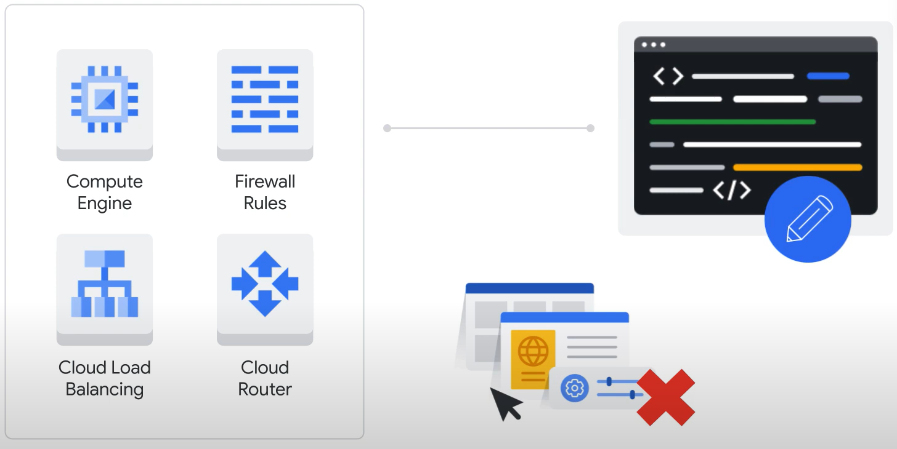
- ✅ Быстрого и безопасного CI/CD.
- ✅ Качества, стабильности, безопасности (DevSecOps).
- ✅ Мониторинга, логирования и быстрого реагирования.

## ⚙️ **2. Основные компоненты DevOps:**
1. **CI/CD (непрерывная интеграция и развертывание)**:
- **Цель:** Доставка кода в продакшн **максимально быстро и без ошибок**.
- 🔹 **CI (Continuous Integration)** – автоматическая сборка и тестирование кода после каждого изменения.
- 🔹 **CD (Continuous Deployment)** – автоматическое развертывание новых версий без ручного вмешательства.
- 📌 **Среди инструментов:** Мы будем использовать GitHub Actions.
2. **Инфраструктура как код (IaC)**
- **Цель:** Описывать инфраструктуру с помощью кода, а не вручную.
- 📌 **Примеры инструментов:**
  - Terraform — декларативный IaC-инструмент для создания и управления облачной инфраструктурой. Лидер в управлении инфраструктурой как кодом.
  - Ansible — агент-менеджер для конфигурации серверов и развертывания ПО. Прост в использовании.
3. **Мониторинг и логирование**
- **Цель:** Контроль за состоянием системы и предотвращение сбоев.
- 📌 **Примеры инструментов:**
  - Prometheus – система мониторинга и алертинга, собирает и хранит метрики с сервисов.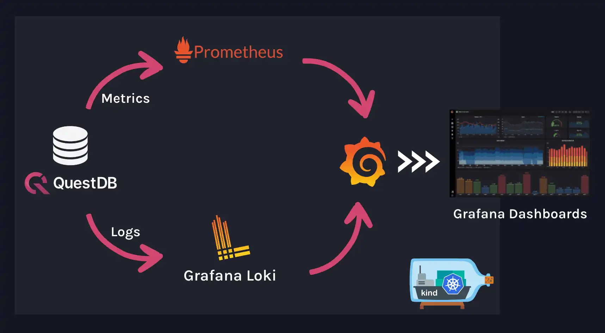
  - Grafana – инструмент визуализации данных, строит дашборды для метрик и логов.
  - Loki – система логирования, оптимизированная для работы с Grafana, легковесная альтернатива ELK.
  - ELK Stack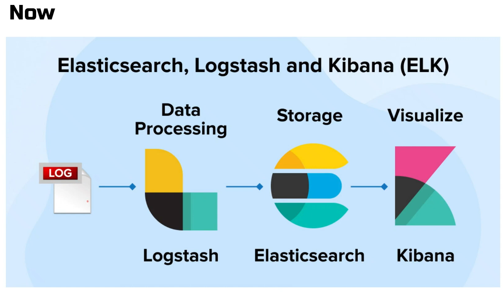(Elasticsearch, Logstash, Kibana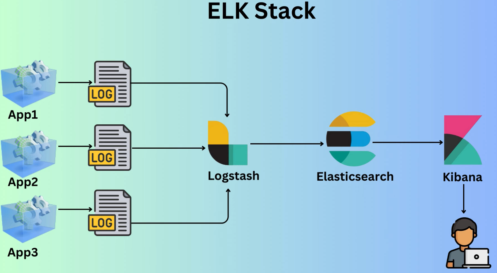) – мощный стек для сбора, хранения, анализа и визуализации логов.
  - ELK Stack состоит из трёх основных компонентов:
    - Elasticsearch – движок поиска и хранения логов, поддерживает быстрый поиск и агрегацию данных.
    - Logstash – инструмент для сбора, обработки и передачи логов в Elasticsearch (может фильтровать и трансформировать данные).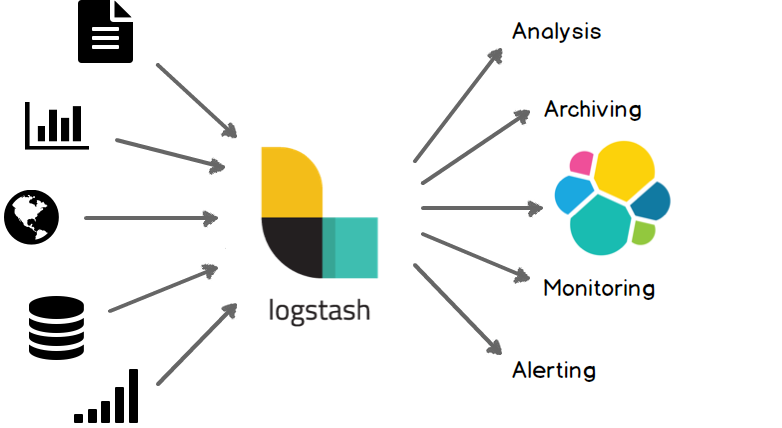
    - Kibana – веб-интерфейс для визуализации данных из Elasticsearch (графики, дашборды, поиск по логам).
#### **Пример Grafana**:
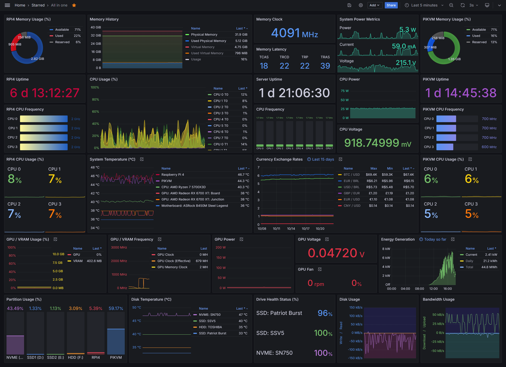
4. **Контейнеризация и оркестрация**
- **Цель:** Упрощение развертывания и управления сервисами.
- 📌 **Примеры инструментов:** Docker, Kubernetes.
#### **Схема Docker**:
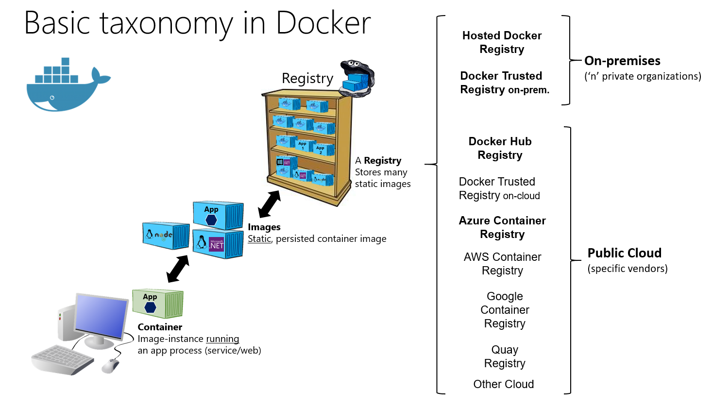
#### **Схема Kubernetes**:
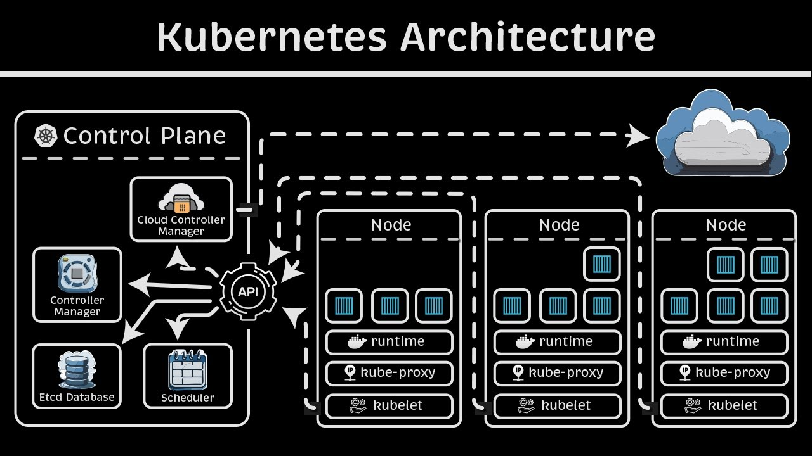
5. **Безопасность (DevSecOps)**
- **Цель:** Встраивание безопасности в процесс DevOps.
- 📌 **Примеры инструментов:**
  - Trivy – сканер уязвимостей для контейнеров, инфраструктуры и зависимостей.
  - HashiCorp Vault – управление секретами и безопасное хранение конфиденциальных данных.

## ⚠️ **3. Заблуждения о DevOps:**
- ❌ **1. DevOps — это просто набор инструментов**
**Нет!** Это **прежде всего культура и процессы**. Инструменты — это только способ реализации DevOps. Без правильного мышления они **не помогут**.
- ❌ **2. DevOps заменяет администраторов и разработчиков**
**Нет!** DevOps **не отменяет**, а **изменяет** роли. Админы становятся SRE (Site Reliability Engineers), а разработчики участвуют в деплое и инфраструктуре.
- ❌ **3. DevOps — это быстро и дешево**
**Не всегда!** Внедрение требует **времени, ресурсов и обучения**. Ошибочное внедрение может **замедлить** процесс и привести к хаосу.
- ❌ **4. DevOps подходит всем**
**Нет!** В маленьких проектах DevOps может создать **лишний оверхед**. Иногда проще оставить классический подход. 

## ⚡ **4. Критика DevOps:**
- ❌ **1. Не серебряная пуля** DevOps — **не панацея!** Если команда не понимает DevOps **или** бизнес-процессы не поддерживают его — он **разрушит** разработку, а не улучшит её.
- ❌ **2. Высокий порог вхождения** DevOps **требует** знаний:
  - ✅ Linux, Bash, Python, cli.
  - ✅ Сетей, виртуализации, безопасности.
  - ✅ Kubernetes, Docker, (Terraform | Ansible) и CI/CD-инструментов.
  - Новичкам вход сложен!
- ❌ **3. Сопротивление компаний** Многие компании не готовы к DevOps из-за старых процессов, сопротивления админов или отсутствия понимания.
- ❌ **4. Риск оверхеда** Если команда маленькая, а инфраструктура простая, DevOps **больше усложнит**, чем облегчит работу. 

## 🚀 **5. Вывод** DevOps — мощный подход, но **не для всех**:.
- 📌 Если бизнес не готов — он **развалит** процессы.
- 📌 Если команда неопытная — DevOps **станет тормозом**.
- 📌 Если внедрен **правильно** — даст **ускорение, надежность, безопасность и гибкость**.

---
---
---
# **BOT development -** 
## — это процесс создания программ, которые автоматически выполняют задачи, имитируя действия человека.
## Боты могут работать в мессенджерах, на сайтах, в социальных сетях или даже управлять бизнес-процессами через API.

## 1. **Типы ботов**
- **Чат-боты** — отвечают на сообщения пользователей;
- **Парсеры** — собирают и анализируют данные (например, ценовые трекеры, новостные агрегаторы).
- **Автоматизаторы** — выполняют повторяющиеся задачи (например, постинг в соцсетях, бронирование билетов).
- **Боты-игроки** — управляют персонажами в играх, фармят ресурсы.
- **Кибербезопасные боты** — анализируют угрозы, защищают системы от атак (анти-DDoS).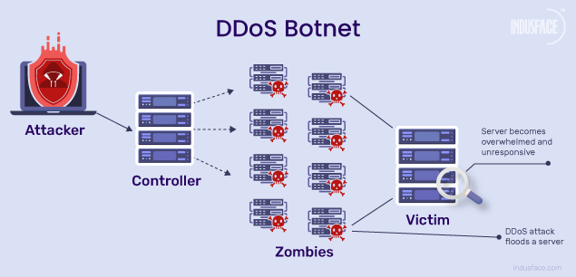(server becomes overwhelmed-сервер перегружен)
- **Зловредные боты** — спамеры, DDoS-боты, фишинговые боты.

## 2. **Разработка ботов на Python**
### Python — один из лучших языков для создания ботов из-за:
- ✔ Легкости разработки (много готовых библиотек).
- ✔ Гибкости и интеграции с API.
- ✔ Поддержки асинхронности (важно для ботов с высокой нагрузкой).

## 3. **Заблуждения про ботов**
- Бот может работать вечно без поддержки ❌ API меняются, появляются баги, а без обновлений бот быстро становится бесполезным. Даже если он просто отправляет сообщения, рано или поздно что-то сломается.
- Бот сам обучается со временем ❌ если в коде не заложен механизм обучения (например, ML), бот не станет умнее. Даже AI-боты требуют ручного контроля, иначе они могут обучиться тому, чему не надо.
- Ботам не нужны ресурсы ❌ даже простой бот требует серверов, хранилища логов, а если он популярен — мощного железа и масштабирования. Если бот работает с AI, стоимость его поддержки может быть огромной.
- Бот может заменить живого сотрудника ❌ боты хороши в рутинных задачах, но сложные вопросы, жалобы и нестандартные ситуации им не по зубам. Компании, которые пытались заменить саппорт ботами, быстро вернули людей.
- Любой бот может работать на любом сервисе ❌ многие платформы (WhatsApp, Instagram, Telegram, Discord) имеют жёсткие ограничения или требуют официального API с модерацией. Парсинг без разрешения может привести к бану.
- Боты не могут обойти капчу ❌ могут. Есть сервисы, которые разгадывают капчу через нейросети или дешёвый ручной труд. Но это незаконно в большинстве случаев, а честным ботам это просто не нужно.

## 4. **Минусы разработки ботов**
- ⚠ Блокировки (особенно у парсеров и ботов для соцсетей).
- ⚠ Ограничения API (лимиты запросов).
- ⚠ Постоянные обновления (нужно следить за изменениями платформ).
- ⚠ Уязвимости (боты могут быть атакованы).

## 5. **Где реально зарабатывать на ботах?**
- 💰 **Чат-боты для бизнеса** (поддержка клиентов, заказы).
- 💰 **Автоматизация процессов** (парсинг, постинг).
- 💰 **Боты для трейдинга** (авто-торговля на биржах).
- 💰 **Кибербезопасность** (анти-DDoS, защита API). 

### **Вывод**
Python отлично подходит для разработки ботов. Но перед созданием важно понимать ограничения API, риски блокировки и необходимость постоянного обновления кода.

---
---
---

# [vscode](https://code.visualstudio.com/download)
### Extensions
### Settings
### Json Settings

# [Python](https://www.python.org/downloads/)

# Напишите своё Ф.И.О. и выведите на кансоль

# [Touch-typing](https://www.ratatype.com/)
# [Keyboard-shortcuts](https://www.shortcutfoo.com/app/dojos/vscode-win)

---
---
---
# **HomeWork**
1. Пусть каждый виберит по одной теме для поверхностного изучения и немного расскажет то что изучил на следующем уроке
2. Дома потренируйтесь по Touch-Typing & Keyboard-Shortcuts! На следующем уроке посмотрим результаты.
3. Поковыряйтесь в vscode, настройте его по своиму удобству, поустанавливайте нужные расширения и т. д.
4. Попробуйте написать что-нибудь на python 

## Пожалуйста ответьте на все вопросы честно!
- Ваш возраст: (  )
- Ваш текущий род деятельности: (  )
- Ваш опыт работы в IT: (  )
- Какие цели вы преследуете, записываясь на этот курс?: (  )
- Чего вы ожидаете от этого курса?: (  )
- Проходили ли вы ранее какие либо курсы по IT елсли да то по каким направлениям?: (  )
- Ваш примерный уровень английского языка: (  )

Оцените свои теоретические и практические навыки от 0 - до 12 по:
- Python: (  )
- Back-End: (  )
- DevOps: (  )
- UX/UI Дизайн: (  )
- Базы данных: (  )
- Front-End: (  ) / Mobile: (  ) / Desktop: (  )
- Искусственный интеллект (AI): (  )
- Data Science: (  )
- Тестирование: (  )
- Кибербезопасность: (  )
- Боты: (  )
- Встроенные системы и цифровая электроника: (  )
- Блокчейн: (  ) / Web3: (  ) / Смарт-контракты: (  )

